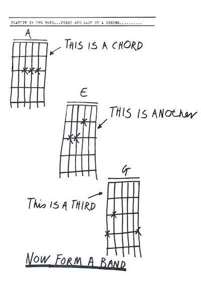

# Programación Creativa

Este curso corresponde a una introducción al diseño de software como una herramienta de expresión artística construyendo obras visuales cinéticas o interactivas basadas en [Processing](https://processing.org). 

Trataremos los fundamentos de la forma computacional y de la estructura de la programación gráfica en consonancia con principios matemáticos abstractos. Te familiarizarás con algoritmos básicos, geometría computacional y simulación cinemática además de los conceptos necesarios para construir programas. 

### Objetivos

- Descubrir herramientas programáticas de diseño digital 
- Desarrollar pensamiento algorítmico
- Transladar pensamiento plástico y/o constructivo hacia algortimos programáticos
- Programar animaciones y efectos visuales 
- Integrar diferentes tecnologías y herramientas digitales para comunicar los proyectos de una manera novedosa.

## [Clase I](https://hspencer.github.io/programacion_creativa/presentaciones/clase_01/index.html) ~ [↓pdf](https://hspencer.github.io/programacion_creativa/presentaciones/clase_01.pdf)

1. Una breve historia, e introducción a Processing como entorno de desarrollo
2. Dibujo, trazo y color `line()`, `rect()`, `ellipse()`, `triangle()`, `beginShape()`, `endShape()`, `vertex()`, `curveVertex()`, `bezierVertex()`
3. Funciones
4. Estructura de un programa

#### Encargo

*Desde las funciones de dibujo (formas y colores) diseñar una forma dinámica para dar cuenta del paso del tiempo.*

### Referencias
1. [Processing](http://processing.org)
2. [A Modern Prometeus](https://medium.com/processing-foundation/a-modern-prometheus-59aed94abe85)
3. [Lista de tutoriales](http://p5art.tumblr.com/tutorials)

## [Clase II](https://hspencer.github.io/programacion_creativa/presentaciones/clase_02/index.html) ~ [↓pdf](https://hspencer.github.io/programacion_creativa/presentaciones/clase_02.pdf)

1. Variables o tipos de datos `boolean`, `int`, `float`, `color` repeticiones `for, while` y condicional `if()`
2. Variables del entorno `mouseX`, `mouseY`, `millis(), second()`, etc.
3. *Variable scoping*, funciones personalizadas y anidamiento
4. Espacio 2D y 3D y funciones de transformación `pushMatrix()`& ` popMatrix()`, `rotate`, `translate`, `scale` 

### Referencias
1. [The Coding Train](https://www.youtube.com/channel/UCvjgXvBlbQiydffZU7m1_aw)
2. [The Nature of Code](http://natureofcode.com/book/), libro de Dan Shiffman

#### Encargo
*A partir del [ejemplo visto en clase](clase_02/ejemplo_05_dibujo) explorar nuevas formas de aumentar el trazo del dibujo. A partir de los valores `mouseX, mouseY, pmouseX, pmouseY` podemos deducir velocidad y ángulo entre otras cualidades. Este trabajo es ocasión de:*

- *construir una función personalizada que reemplace `line(mouseX, mouseY, pmouseX, pmouseY)`*
- *utilizar la repetición `for()` para construir elementos más complejos*
- *interpretar el input del usuario de forma creativa. Por ejemplo, la función `atan2()` permite obtener el ángulo entre la posición previa y la actual del mouse.*

## [Clase III](https://hspencer.github.io/programacion_creativa/presentaciones/clase_03/index.html) ~ [↓pdf](https://hspencer.github.io/programacion_creativa/presentaciones/clase_03.pdf)

1. Arreglos de datos `float[]`, `int[]`, etc.
2. Objetos y su metáfora de programación `class{}`
3. Eventos `mousePressed`, `mouseReleased`, etc.
4. Extendiendo processing: Bibliotecas
5. Partículas y simulaciones
6. [P5.js](https://p5js.org)
7. [Arduino](https://arduino.cc)

### Referencias
1. [Process Compendium](http://www.creativeapplications.net/processing/process-compendium-processing/), [documento completo](https://drive.google.com/file/d/0B9h469--G5OwOGVfVmUxZUQ5VzA/view)
2. [Process Compendium, Casey Reas](https://vimeo.com/39078622) (video)

#### Encargo
*Se trata de un proyecto individual libre que incorpore los conceptos como ciclos `for()` anidados (2D o más), interactividad `mousePressed()`, `keyPressed()`, y/o objetos `class{}`. La entrega final se realiza en el Google Drive Compartido.*

### Para continuar el camino
- [Processing: a programming handbook for visual designers
and artists)](http://cmuems.com/resources/processing_a_handbook.pdf), libro en formato PDF
- [P5.js](https://p5js.org), Processing portado a javascript para trabajar en el browser
- [Open Frameworks](https://openframeworks.cc/), Proyecto en C++ similar a Processing
